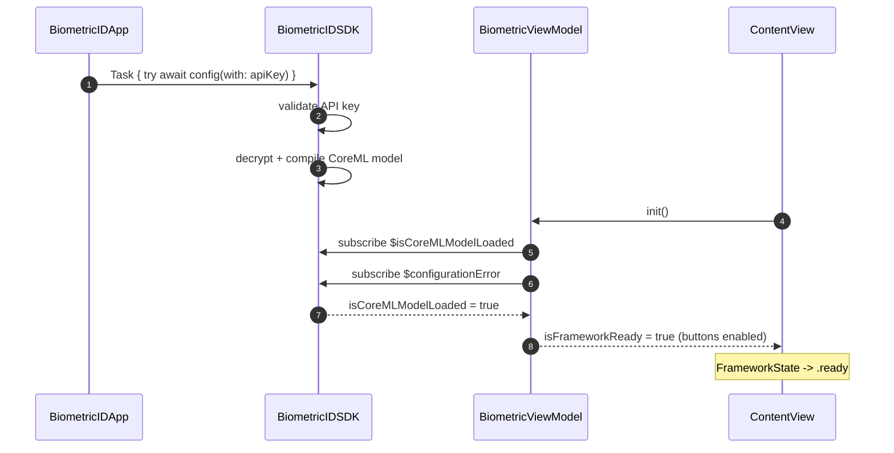
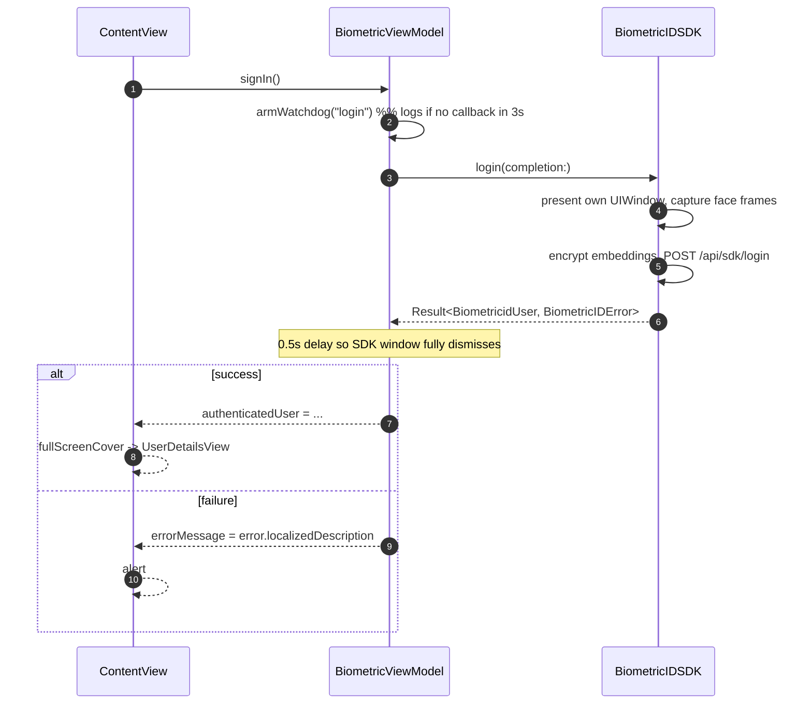
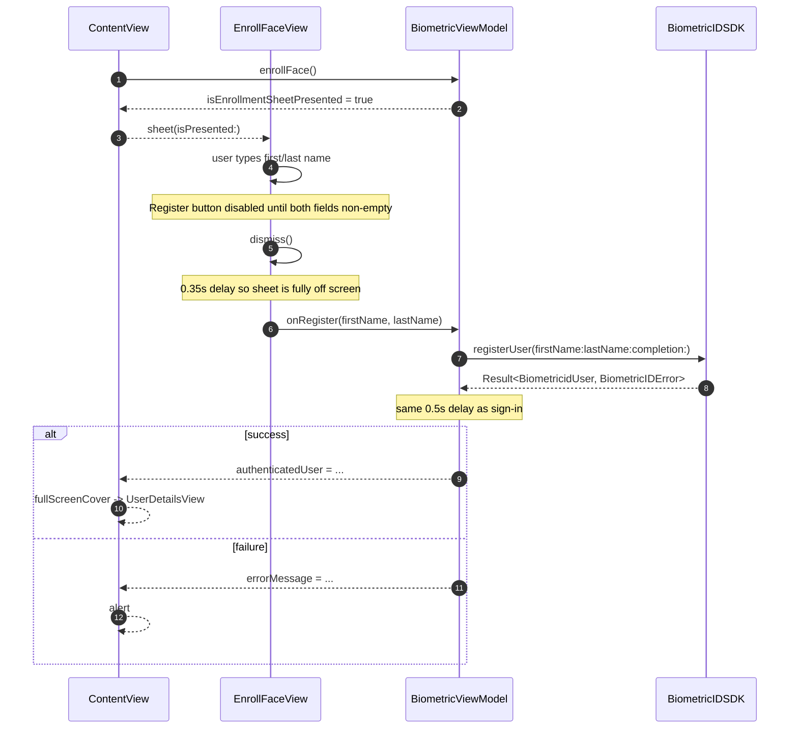

# Architecture

The sample app is intentionally small: one `App` entry point, one root view,
one view-model, and two secondary screens. The view-model is the single point
where SwiftUI meets `BiometricidSDK`; every other file either produces UI or
carries data.

## Module layout

```
BiometricID/
├── BiometricIDApp.swift        # @main; bootstraps the SDK
├── ContentView.swift           # Root screen + framework-state overlays
├── BiometricViewModel.swift    # SDK bridge, @MainActor ObservableObject
├── EnrollFaceView.swift        # Modal enrollment form
└── UserDetailsView.swift       # Post-auth details screen
```

All files sit in a **file-system-synchronized Xcode group**
(`PBXFileSystemSynchronizedRootGroup`): new files dropped into
`BiometricID/` are picked up automatically; the `.pbxproj` does not need to
be edited to register additional sources.

## Component diagram

```mermaid
flowchart TB
    App[BiometricIDApp] --> Root[ContentView]
    Root -->|@StateObject| VM[BiometricViewModel]

    subgraph SDK[BiometricidSDK.xcframework]
        SDKAPI[BiometricIDSDK.shared]
        Pub1[$isCoreMLModelLoaded]
        Pub2[$configurationError]
        Login[login&#40;completion:&#41;]
        Register[registerUser&#40;firstName:lastName:completion:&#41;]
        Config[config&#40;with:&#41;]
    end

    App --> Config
    VM -->|subscribes via Combine| Pub1
    VM -->|subscribes via Combine| Pub2
    VM -->|calls| Login
    VM -->|calls| Register

    Root -->|fullScreenCover&#40;item:&#41;| Details[UserDetailsView]
    Root -->|sheet&#40;isPresented:&#41;| Enroll[EnrollFaceView]
    Root -->|alert| Alert[Error alert]
```

## State model

`BiometricViewModel` publishes five values the UI observes:

| Property | Purpose |
|---|---|
| `isFrameworkReady: Bool` | Mirror of `BiometricIDSDK.isCoreMLModelLoaded` |
| `configurationError: BiometricIDError?` | Mirror of `BiometricIDSDK.configurationError` |
| `authenticatedUser: AuthenticatedUser?` | Drives `fullScreenCover` for details |
| `errorMessage: String?` | Drives per-operation error `alert` |
| `isEnrollmentSheetPresented: Bool` | Drives the enrollment `sheet` |

The first two are collapsed into a single derived enum used by the view:

```swift
enum FrameworkState {
    case loading                 // configurationError == nil && !isFrameworkReady
    case ready                   // isFrameworkReady == true
    case failed(BiometricIDError) // configurationError != nil
}
```

`ContentView` `switch`es on `frameworkState` and paints one of:

- `LoadingOverlay("Loading BiometricID Framework")`
- `ConfigurationErrorOverlay(error:)`
- (nothing) — the two action buttons are shown unmodified

## Startup timeline



If configuration fails at any step the SDK emits a value on
`$configurationError` instead; the view flips to `.failed(...)`.

## Sign-in flow



## Enrollment flow



## Concurrency model

- The whole app runs with `SWIFT_DEFAULT_ACTOR_ISOLATION = MainActor` — every
  type defaults to `@MainActor` unless declared otherwise.
- `BiometricViewModel` is explicitly `@MainActor`.
- `handleCompletion(_:source:)` is declared `nonisolated` because the SDK is
  free to invoke its `CompletionCallback` on any queue. The method logs
  first, then hops back to the main queue via
  `DispatchQueue.main.asyncAfter(deadline: .now() + 0.5)` before mutating any
  `@Published` property.
- The 0.5-second hop is not cosmetic: on success the SDK dismisses its own
  `UIWindow` with an animation, and applying state changes while that
  window is still key races with SwiftUI's `fullScreenCover(item:)`
  presentation.
- The SDK's `import BiometricidSDK` uses `@preconcurrency` in every file
  that touches it, because the framework does not annotate its types as
  `Sendable`. Strict concurrency checking stays enabled for the app's own
  code.

## Diagnostic logging

Every meaningful state transition is logged through a file-local
`nonisolated func log(_ message: String)` that prints
`"[APP] \(message)"`. This deliberately uses `print` (not `os.Logger`) so
the app's log lines interleave with the SDK's own `print` output in Xcode's
debug console. See [Framework overview](Framework.md) for how the log
messages line up with SDK-side events, and [Usage guide](Usage.md) for a
recipe you can copy into your own app.
