# BiometricidSDK — Framework Overview

`BiometricidSDK` is a prebuilt iOS xcframework that provides on-device face
recognition (CoreML), server-assisted enrollment/login, and a
ready-to-use camera capture UI.

The framework binary is distributed as
`BiometricidSDK.xcframework/` at the root of this repository and contains
two slices:

- `ios-arm64` — devices
- `ios-arm64_x86_64-simulator` — simulator

An encrypted CoreML model (`AdaFaceIR101_quantized.encdata`) and an ECIES
public key ship inside the framework bundle; they are decrypted, compiled,
and loaded on first configuration.

---

## Where to get an API key

Every operation is scoped by an API key. Register at
**https://biometricid.eu.com** and generate one — it is **free for
evaluation**.

Support contact: **support@biometricid.eu.com**

---

## Public surface

The public API is small and stable. All symbols live under the
`BiometricidSDK` module.

### Singleton entry point

```swift
public class BiometricIDSDK {
    public static let shared: BiometricIDSDK
}
```

### Configuration

```swift
public func config(with apiKey: String) async throws
```

Boot the SDK. Validates the key against the backend, decrypts the CoreML
model, compiles it, and loads it into memory. Call once per process
lifetime, as early as possible (typically from your `App`'s `init()`).

The `throws` mostly signals gross misuse (e.g. empty key). All post-boot
readiness and failure signals are delivered through the two publishers
below, not through the return of this call.

### Combine publishers

```swift
@Published public var isCoreMLModelLoaded: Bool
public var $isCoreMLModelLoaded: Published<Bool>.Publisher { get }

@Published public var configurationError: BiometricIDError?
public var $configurationError: Published<BiometricIDError?>.Publisher { get }
```

Three observable states result:

| `configurationError` | `isCoreMLModelLoaded` | UI meaning |
|---|---|---|
| `nil` | `false` | SDK is initialising → show loading |
| `nil` | `true`  | SDK is ready → enable actions |
| non-`nil` | (any) | Fatal configuration failure → show error |

Emissions arrive on an internal queue; hop to the main queue with
`.receive(on: DispatchQueue.main)` before touching UI.

### Sign in

```swift
public typealias CompletionCallback =
    (Result<BiometricidUser, BiometricIDError>) -> Void

public func login(completion: @escaping CompletionCallback)
```

Presents the SDK-owned camera capture UI in a dedicated `UIWindow`,
recognises the face, calls the backend, and delivers the identified
`BiometricidUser` (or an error) through `completion`.

The completion may fire on any queue. Marshal to the main queue before
touching SwiftUI state.

### Register a new face

```swift
public func registerUser(
    firstName: String,
    lastName: String,
    completion: @escaping CompletionCallback
)
```

Same UX shape as `login`, but records the captured embeddings against the
supplied name and returns the freshly-created `BiometricidUser`.

### Result payload

```swift
public struct BiometricidUser: Codable {
    public let userId: String
    public let firstName: String
    public let lastName: String
    public let lastLoginDate: Date
}
```

Not `Identifiable` or `Hashable`. This app wraps it in a tiny
`AuthenticatedUser: Identifiable` shim to feed
`fullScreenCover(item:)` — see
[`BiometricViewModel.swift`](../BiometricID/BiometricViewModel.swift).

### Error taxonomy

```swift
public enum BiometricIDError: LocalizedError {
    case apiKeyNotFound
    case accountNotActive
    case subscriptionInactive
    case userNotFound
    case userNotActive
    case userAlreadyExists
    case reachedMaximumNumberOfUsers
    case networkError(String)
    case serverError(String)
    case userCancelled
    case biometricFailed(String)
    case authenticationFailed(String)
    case unknown(String)
}
```

Every case ships a localized `errorDescription`. Use
`error.localizedDescription` for user-facing text; switch on the concrete
case only if you need to react programmatically (retry, gate features,
etc.).

---

## Data flow at runtime

```mermaid
flowchart LR
    App[Your App] -->|config&#40;with:&#41;| SDK
    SDK -->|POST /api/sdk/validate-key| Backend[(BiometricID backend)]
    SDK -->|decrypt + compile model| CoreML

    App -->|subscribe| PubReady[$isCoreMLModelLoaded]
    App -->|subscribe| PubErr[$configurationError]

    App -->|login&#40;&#41;| SDK
    SDK -->|IR + Vision face capture| Cam[TrueDepth camera]
    Cam --> CoreML
    CoreML -->|embeddings| SDK
    SDK -->|ECIES-encrypted embeddings| Backend
    Backend -->|match result| SDK
    SDK -->|CompletionCallback| App

    App -->|registerUser&#40;&#41;| SDK
```



## Runtime requirements

- **iOS 26.5+** (deployment target of this sample; the framework's
  swiftinterface targets `arm64-apple-ios16.0-simulator`).
- **Front TrueDepth camera** for the real biometric path. Devices without
  it fall back to IR-only mode automatically.
- **Info.plist**:
  - `NSCameraUsageDescription` — required, or the app will crash the
    first time the SDK opens the camera.
  - `NSFaceIDUsageDescription` — recommended, in case the SDK triggers a
    system Face ID prompt.
- **Network access** to `https://biometricid.eu.com` for API-key
  validation, enrollment, and login.

## Integration checklist

1. Add `BiometricidSDK.xcframework` to the app target under **Frameworks,
   Libraries, and Embedded Content**, with **Embed & Sign**.
2. Ensure `FRAMEWORK_SEARCH_PATHS` covers the location of the xcframework.
3. Add `NSCameraUsageDescription` (and ideally `NSFaceIDUsageDescription`).
4. Add `@preconcurrency import BiometricidSDK` in every file that touches
   SDK types — the framework does not annotate `Sendable`, and this keeps
   Swift 6 concurrency checks quiet without disabling them in your own
   code.
5. Bootstrap once at process start with your API key, then react to the
   two publishers.

See [Usage guide](Usage.md) for concrete code.
